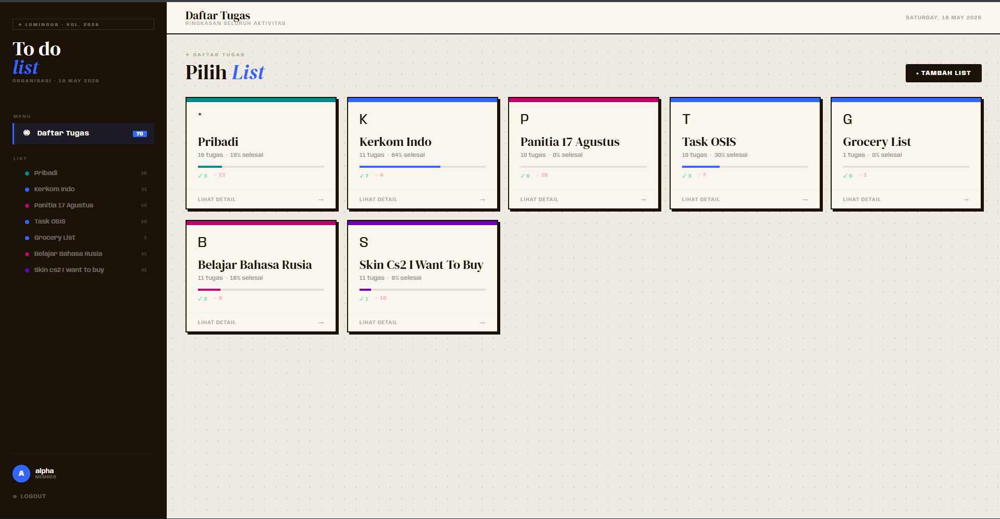
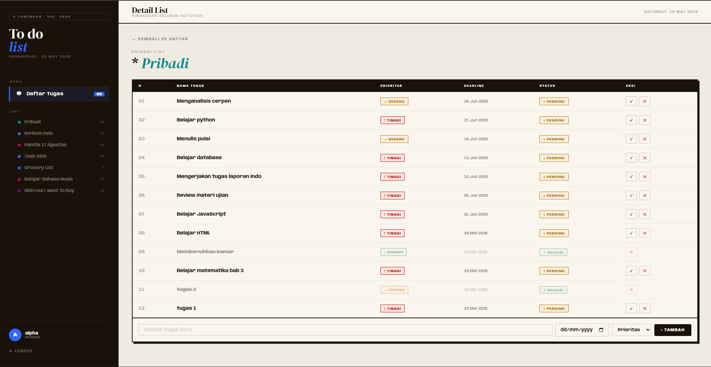

# To Do List

  Project ini dibuat untuk membantu pengguna mengelola tugas harian dengan tampilan modern, sederhana, dan mudah digunakan.





---


## Project Structure

```bash
UAS/
├── class/
│   ├── Tugas.php
│   ├── TugasListManager.php
│   ├── TugasListMembers.php
│   └── TugasModel.php
│
├── config/
│   └── database.php
│
├── css/
│   ├── dashboard.css
│   ├── login.css
│   └── register.css
│
├── image/
│   ├── image.png
│   └── image2.png
│
├── js/
│   ├── dashboard.js
│   ├── login.js
│   └── register.js
│
├── edit_list.php
├── hapus.php
├── hapus_list.php
├── hapus_selesai.php
├── hapus_semua.php
├── index.php
├── login.php
├── logout.php
├── proses_login.php
├── proses_register.php
├── README.md
├── register.php
├── selesai.php
├── sqlcommands.sql
├── tambah.php
└── tambah_list.php
```


---

## OOP Concepts Used

Project ini menggunakan beberapa konsep OOP seperti:

- Encapsulation
- Inheritance
- Constructor
- Getter & Setter
- Object & Class

---

## Purpose

Project ini dibuat sebagai media pembelajaran dan implementasi konsep OOP PHP dalam pengembangan aplikasi task management sederhana.

---

